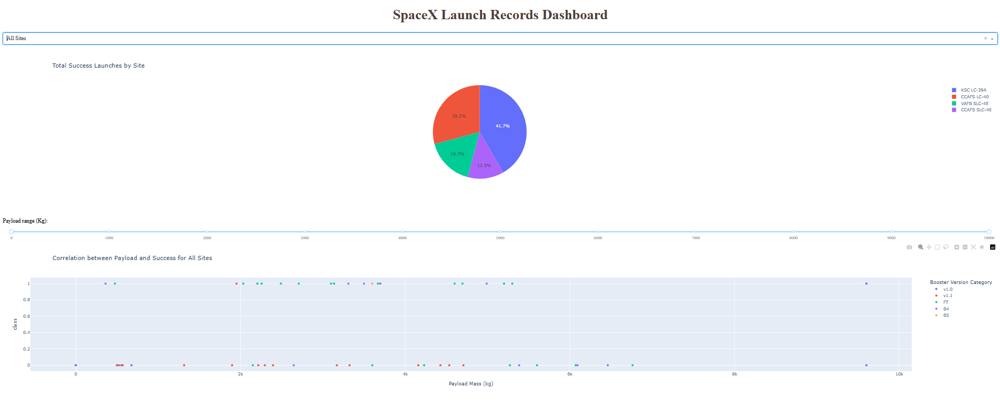

# Falcon 9 Landing Success Analysis 🚀

  

This project explores the factors influencing the success of SpaceX's Falcon 9 first stage landing.  
Data science techniques such as exploratory analysis, interactive visualization and classification models are applied to find patterns and make predictions.
- Python (Pandas, Matplotlib, Scikit-learn, Plotly, Folium)
- SQL (SQLite)
- SpaceX API + Web scraping
- Jupyter Notebook
- Git/GitHub
- Jupyter notebooks with step-by-step analysis.
- Processed CSV files.
- .py files with reusable functions.
-  Generated graphics and images.
- `README.md` - This file.
- Interactive visualization with Plotly Dash.

You can review the step-by-step analysis, visualize the patterns found and run the predictive models to understand how different factors affect the success of Falcon 9.

If you are learning data science, this project can serve as a practical guide from start to finish.
1. Clone the repository.
2. Install the dependencies with `pip install -r requirements.txt`.
3. Open the notebooks in Jupyter.

This is my first project applying data science tools, aiming to complement my training as an economist.  

I am learning and open to suggestions, collaborations or feedback 🤓.
